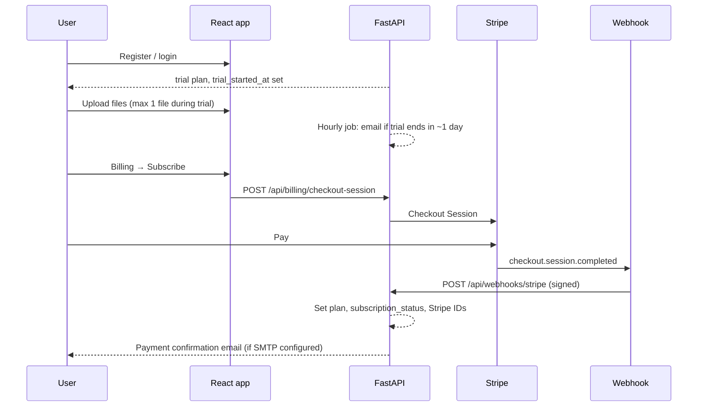

# Trial, Stripe billing, and plan enforcement

This document describes how a user moves from **trial** to **paid subscription**, how **Stripe webhooks** sync state, and how the **API enforces** uploads and BI features.

## Flow overview



## Plan matrix

| Plan       | Files                         | BI summary | Charts | Insights | PDF reports | Alerts (enterprise) |
|-----------|-------------------------------|------------|--------|----------|-------------|---------------------|
| Trial     | 1 file total (3 days)         | Yes        | Yes    | Yes      | Yes         | No                  |
| Starter   | 3 / calendar month (UTC)      | Yes        | Yes    | No       | Yes         | No                  |
| Pro       | Unlimited                     | Yes        | Yes    | Yes      | Yes         | No                  |
| Enterprise| Unlimited + org / multi-tenant| Yes        | Yes    | Yes      | Yes         | Yes                 |

**Trial expiry**: After **3 days** on `trial`, uploads and paid-style actions are blocked until the user upgrades (or an admin changes the plan). While the trial is active, users may upload **at most 1 file** (lifetime during the trial) but get **Pro-level** BI (including insights) and PDF reports; **not** enterprise-only alerts.

**Cancellation**: Stripe `customer.subscription.deleted` (and related events) downgrade the user back toward trial / clears paid subscription fields per `handle_stripe_event` in `backend/app/services/billing_stripe.py`.

## Configuration

- **Database**: run `alembic upgrade head` (includes migration `003_stripe` for Stripe columns and email-tracking timestamps).
- **Stripe**: create three recurring prices (Starter $49, Pro $99, Enterprise $199) and set:
  - `STRIPE_SECRET_KEY`
  - `STRIPE_WEBHOOK_SECRET` (from the Stripe CLI or Dashboard webhook endpoint)
  - `STRIPE_PRICE_STARTER`, `STRIPE_PRICE_PRO`, `STRIPE_PRICE_ENTERPRISE`
- **Public URL**: `PUBLIC_APP_URL` (maps to `public_app_url`) — browser base URL **without** trailing slash, e.g. `http://localhost:5173`, used for Checkout success/cancel redirects.
- **Email** (optional): set `SMTP_HOST`, `SMTP_PORT` (usually `587`), `SMTP_USER`, `SMTP_PASSWORD`, `SMTP_FROM`, and `SMTP_USE_TLS` (typically `true` for STARTTLS). If `SMTP_HOST` is empty, messages are only written to the application log. Use credentials from your provider (SendGrid, SES, Mailgun, Gmail app password, etc.); the app expects **STARTTLS** on the submission port (not implicit SSL on 465 unless you add support). See comments in `.env.example`.
- **Admin recipients**: set **`ADMIN_EMAILS`** (comma-separated). Those addresses receive alerts for new signups, admin-driven account/plan changes, and Stripe events (payment, subscription updates, past due, cancellation). Implementation: `backend/app/services/system_notifications.py`.

### Who gets which emails

| Event | User | Admins (`ADMIN_EMAILS`) |
|-------|------|-------------------------|
| Self-registration | Welcome + account details | New user alert (registrant excluded from admin list to limit duplicate mail if they are an admin) |
| Stripe Checkout completed | Payment / plan active | New subscription alert |
| Stripe `subscription.updated` | Plan/status change (except duplicate trial→paid; checkout already emailed) | Same summary |
| Stripe past due / canceled / deleted / downgrade | User-facing notice | Alert |
| Admin: change plan | Confirmation | Who changed it + old/new plan |
| Admin: renew trial | Confirmation | Who renewed |
| Admin: activate / deactivate | Confirmation | Who changed status |

## Webhook security

The endpoint uses the raw request body and `stripe.Webhook.construct_event` with `STRIPE_WEBHOOK_SECRET`. Do not parse JSON before verification.

## Example API JSON

### `GET /api/users/me` (excerpt)

```json
{
  "id": 12,
  "email": "user@example.com",
  "full_name": "Sample User",
  "plan": "trial",
  "subscription_status": null,
  "trial_started_at": "2026-04-01T10:00:00+00:00"
}
```

### `GET /api/dashboard/plan-summary`

```json
{
  "plan": "starter",
  "subscription_status": "active",
  "stripe_customer_id": "cus_xxx",
  "trial_started_at": "2026-03-01T12:00:00+00:00",
  "trial_ends_at": null,
  "trial_expired": false,
  "trial_days_remaining": null,
  "file_limit": 3,
  "file_limit_scope": "month",
  "files_total": 5,
  "files_this_month": 2,
  "files_toward_limit": 2,
  "can_upload": true,
  "stripe_checkout_available": true,
  "features": {
    "bi_summary": true,
    "bi_charts": true,
    "bi_insights": false,
    "pdf_reports": true,
    "alerts": false
  },
  "notifications": []
}
```

### `GET /api/billing/plans`

```json
{
  "plans": [
    {
      "id": "starter",
      "name": "Starter",
      "price_usd_month": 49,
      "description": "Up to 3 files per month, dashboards and PDF reports."
    }
  ]
}
```

### Admin list item (`GET /api/admin/users`) — excerpt

```json
{
  "id": 3,
  "email": "admin-visible@example.com",
  "plan": "pro",
  "subscription_status": "active",
  "stripe_customer_id": "cus_xxx",
  "stripe_subscription_id": "sub_xxx",
  "files_uploaded": 12,
  "storage_bytes_total": 10485760
}
```

## Email templates (examples)

Use these as HTML or text bodies; replace placeholders at send time.

**Trial expiring soon** (≈1 day left)

- Subject: `Your trial ends tomorrow — upgrade to keep uploading`
- Body: `Hi {name}, your Reporting SaaS trial ends on {trial_end_date}. Upgrade at {billing_url} to avoid interruption.`

**File limit reached**

- Subject: `You've reached your plan's file limit`
- Body: `Hi {name}, your {plan} plan allows {limit} file(s) ({scope}). Remove old datasets or upgrade at {billing_url}.`

**Payment confirmation**

- Subject: `Payment confirmed — {plan_name} is active`
- Body: `Thanks {name}. Your subscription is active. Manage billing anytime at {billing_url}.`

**Plan upgrade reminder** (optional campaign)

- Subject: `Unlock insights and unlimited files`
- Body: `Hi {name}, Pro includes automated insights and unlimited uploads. See {billing_url}.`
